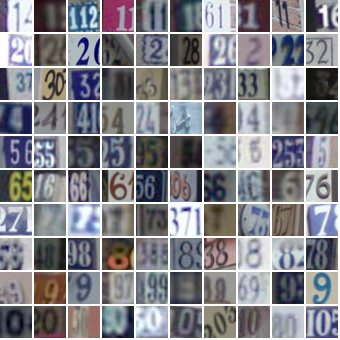

# Deep-Convolutional-GANs

In this notebook, I'll build a GAN using convolutional layers in the generator and discriminator. This is called a Deep Convolutional GAN, or DCGAN for short.
The DCGAN architecture was first explored in 2016 and has seen impressive results in generating new images.

I'll be training DCGAN on the Street View House Numbers (SVHN) dataset.
These are color images of house numbers collected from Google street view. SVHN images are in color and much more variable than MNIST.

So, the goal is to create a DCGAN that can generate new, realistic-looking images of house numbers.
similer to (SVHN) dataset shown in the picture below:

The way I will do that shown in the ppicture below:

